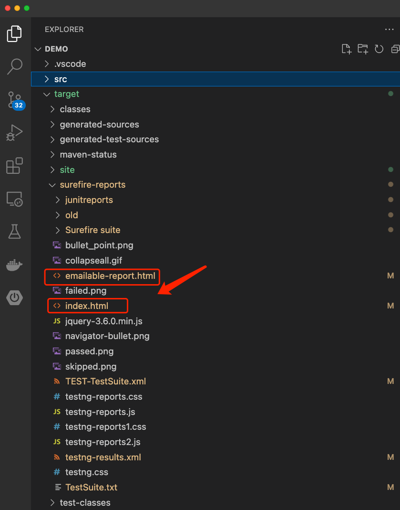

## Overview

This project is a selenium framework. Its script is written in Java with Maven and TestNG to test https://buggy.justtestit.org/. The procedure below should be executed via Mac. Steps might be different if you are using Windows.

## two ways to excute the test

Run the tests in CI/CD - fork the repo to your github; with every pull and push, the tests will be executed in your GitHub Actions setup by .yml file. you can download and check test report in github action as well.

Or

Run the tests on your own machine -  follow the following steps. 

---
(By the way screen recording of automation testing is available in src/test/java/com/buggycar/resource folder)
Ensure that you have installed Java and Maven on your system. You can verify this by running the following commands in your terminal:

    java -version
    mvn -version

Clone the project repository to your local system.

Navigate to the project directory using the terminal.

Run the following command to download the dependencies required for the project:

    mvn clean install

Once the dependencies are downloaded, you can run the test using the following command:

    mvn test

The test results will be displayed in the console. You can also generate a detailed test report by running the following command:

mvn surefire-report:report

This will generate a HTML report in the target/surefire-report folder.
You can download test report in your browser

if you want to run different browser in your own machine just change browser driver name from chrome to firefox or safari in BaseTest.java file.